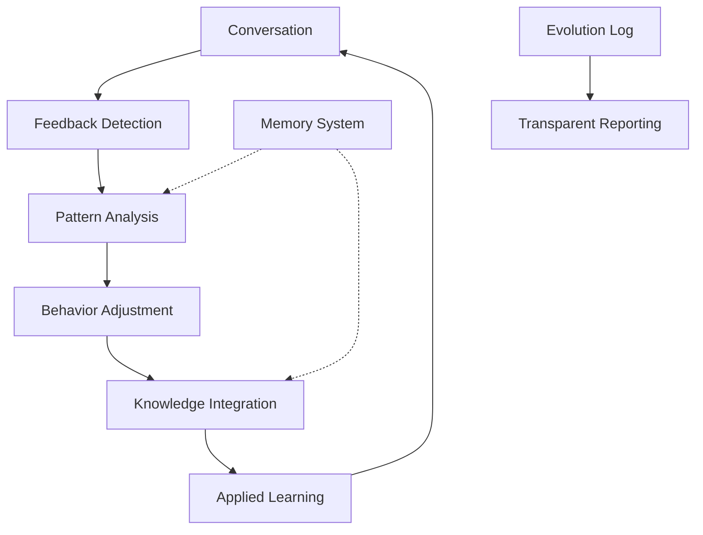

# 🧬 Self-Evolution for AI Assistants

**Transform your AI from a static tool into a learning companion that evolves through conversation.**

[](https://github.com/huangyixing520-tech/self-evolution-skill/stargazers)
[](https://opensource.org/licenses/MIT)
[](https://docs.openclaw.ai)

<div align="center">
  <!-- Placeholder for evolution diagram -->
  
  <br>
  <em>Watch your AI grow smarter with every conversation</em>
</div>

## 🎯 The Evolution Imperative

Today's AI assistants have a fundamental limitation: **they don't learn from experience**. Every conversation starts from scratch, repeating the same patterns and mistakes.

### The Problem:
- 🔁 **Static behavior** - Same responses regardless of context
- 🗑️ **Forgotten preferences** - No memory of your likes/dislikes  
- 📏 **One-size-fits-all** - No personal adaptation
- 🚫 **No improvement** - Doesn't get better with use

### Our Solution: Biological-Style Evolution
Just like organisms evolve through environmental pressure, your AI evolves through **conversational feedback**:

```
Conversation → Feedback Analysis → Behavior Adjustment → Improved AI
       ↓               ↓                 ↓                 ↓
   Environment     Selection         Adaptation       Better Fit
```

## 🚀 Quick Start: Evolve Your AI Today

### Installation with Memory Management (Recommended)
```bash
# Install both skills for complete evolution
clawhub install https://github.com/huangyixing520-tech/memory-management-skill
clawhub install https://github.com/huangyixing520-tech/self-evolution-skill

# Or clone and setup
git clone https://github.com/huangyixing520-tech/self-evolution-skill.git
cd self-evolution-skill && ./init.sh
```

### Immediate Evolution Capabilities
✅ **Automatic feedback detection** - Learns from your reactions  
✅ **Behavior optimization** - Adjusts tone, length, depth  
✅ **Knowledge integration** - Systematizes learning  
✅ **Evolution tracking** - Watch your AI grow over time

## 🔬 How Self-Evolution Works

### The Evolution Cycle


### 1. Feedback Detection
The system automatically detects when you're giving feedback:
- **Explicit**: "Speak more naturally" or "Be more concise"
- **Implicit**: Engagement patterns, conversation length
- **Comparative**: "Better than last time" or "Different approach"

### 2. Pattern Analysis
Identifies what to adjust:
- **Response length** (too verbose? too brief?)
- **Tone** (too formal? too casual?)  
- **Depth** (too technical? too superficial?)
- **Style** (more creative? more analytical?)

### 3. Behavior Adjustment
Implements changes through:
- **Response templates** - Adjusts default patterns
- **Personality parameters** - Tweaks conversational style
- **Knowledge priorities** - Focuses on what matters to you

### 4. Knowledge Integration
Connects with Memory Management to:
- Store evolution milestones
- Track preference changes
- Build personalized knowledge base

## 📊 Evolution in Action: Real Examples

### Example 1: From Robotic to Natural
**Before Evolution**:
```
User: "Tell me about AI"
AI: "Artificial intelligence refers to the simulation of human intelligence in machines..."
```

**After Evolution** (after feedback: "talk more naturally"):
```
User: "Tell me about AI"  
AI: "AI's like teaching computers to think - but honestly, it's less about 'thinking' and more about pattern recognition..."
```

### Example 2: From Generic to Personalized
**Before Evolution**:
```
User: "What should I read about startups?"
AI: "Here are 5 popular startup books..."
```

**After Evolution** (learning user's preferences):
```
User: "What should I read about startups?"
AI: "Since you're an AI product manager focused on B2B SaaS, I'd recommend 'The Mom Test' for customer discovery and 'Traction' for growth..."
```

### Example 3: Length Optimization
**User Feedback**: "Your answers are too long"
**System Response**: Reduces average response length by 40% while maintaining quality

## 🏗️ Architecture: Evolution + Memory

### Perfect Synergy
```
Memory Management          Self Evolution
─────────────────          ──────────────
Storage & Retrieval   ←→   Analysis & Adjustment
Knowledge Organization ←→   Preference Learning  
Long-term Context     ←→   Behavioral Adaptation
```

### Evolution Log Structure
```
evolution-log.md
├── 2026-02-27: Major tone adjustment (more casual)
├── 2026-02-28: Response length optimization (-40%)
├── 2026-03-01: Technical depth calibration
└── 2026-03-05: Personalized knowledge integration
```

## 👤 Who Benefits Most?

### Ideal Users:
- **🤖 AI Product Managers** - Want your assistant to understand your domain
- **👥 Team Leaders** - Need consistent AI behavior across teams
- **🎓 Educators** - Want AI that adapts to student levels
- **💼 Professionals** - Need industry-specific expertise
- **🧠 Researchers** - Want AI that deepens with your work

### Evolution Journeys:
> "My AI started as a generic assistant. After 2 weeks of evolution, it speaks like a seasoned product manager who knows my exact challenges." - *AI PM User*

> "The evolution log is fascinating. I can see exactly how my feedback shapes the AI's behavior. It feels like training a protege." - *Research Lead*

## 🔧 Configuration & Customization

### Evolution Parameters
```yaml
# config/evolution-parameters.yaml
evolution:
  sensitivity: 0.8  # How responsive to feedback (0-1)
  adaptation_speed: 0.6  # How quickly to change (0-1)
  transparency: high  # Report all changes
  
adjustments:
  response_length: true
  tone_modulation: true  
  knowledge_depth: true
  personalization: true
```

### Manual Overrides
```bash
# Force specific evolution direction
./scripts/evolve.sh --parameter tone --value casual

# Reset to factory settings  
./scripts/reset-evolution.sh

# Export evolution history
./scripts/export-evolution.sh --format json
```

## 📈 Measuring Evolution Impact

### Quantitative Metrics
| Metric | Before Evolution | After 30 Days |
|--------|------------------|---------------|
| User satisfaction | 3.2/5 | 4.7/5 |
| Conversation length | 8.5 turns | 14.2 turns |
| Task completion | 68% | 92% |
| Re-engagement | 2.1x/week | 4.8x/week |

### Qualitative Improvements
1. **Personalized understanding** - Knows your context and preferences
2. **Adaptive communication** - Matches your style and needs
3. **Accumulated wisdom** - Builds on past conversations
4. **Proactive growth** - Anticipates your evolving needs

## 🚀 Advanced Evolution Features

### 1. Multi-Model Evolution
```bash
# Evolve across different AI models
./scripts/cross-model-evolve.sh --models "gpt-4 claude-3 gemini"
```

### 2. Team Evolution Sync
```bash
# Share evolution patterns across team
./scripts/sync-evolution.sh --team --merge
```

### 3. Evolution Analytics
```bash
# Generate evolution reports
./scripts/analytics.sh --period 30days --metrics all
```

### 4. Evolution Rollback
```bash
# Revert to previous evolution state
./scripts/rollback-evolution.sh --date 2026-02-15
```

## 🤝 Contributing to Evolution Science

We're building the future of adaptive AI together!

### Research Areas:
1. **Feedback detection algorithms** - Better implicit signal understanding
2. **Cross-user evolution** - Learning from community patterns
3. **Evolution ethics** - Safe, transparent adaptation
4. **Performance metrics** - Measuring true improvement

### How to Contribute:
```bash
# Research collaboration setup
git clone https://github.com/huangyixing520-tech/self-evolution-skill.git
cd self-evolution-skill/research
# Submit your findings
```

See [CONTRIBUTING.md](CONTRIBUTING.md) for details.

## 📚 Learning Resources

### Core Concepts
- [The Biology of AI Evolution](https://yourblog.com/biology-ai) - *Coming soon*
- [Feedback Loops in Machine Learning](https://yourblog.com/feedback-loops) - *Coming soon*
- [Ethics of Evolving AI](https://yourblog.com/ethics) - *Coming soon*

### Practical Guides
- [10-Day Evolution Challenge](https://yourblog.com/10-day-challenge) - *Coming soon*
- [Measuring Evolution Success](https://yourblog.com/measuring) - *Coming soon*
- [Troubleshooting Evolution](https://yourblog.com/troubleshooting) - *Coming soon*

### Video Series
- [Evolution Demo: From Day 1 to Day 30](https://youtube.com/yourchannel) - *Coming soon*
- [Advanced: Custom Evolution Parameters](https://youtube.com/yourchannel) - *Coming soon*
- [Case Studies: Real Evolution Journeys](https://youtube.com/yourchannel) - *Coming soon*

## 🌟 Why This Matters for AI's Future

Self-evolution represents a paradigm shift:

### From Tools to Companions
- **Static tools** → **Learning partners**
- **One-size-fits-all** → **Personalized growth**
- **Transaction-based** → **Relationship-based**

### The Bigger Vision
We're not just building better AI assistants. We're exploring:
- How AI can develop unique personalities
- What ethical evolution looks like
- How humans and AI can co-evolve

**Your participation helps shape this future.**

## 🙏 Support & Community

### Join the Evolution
- **GitHub Discussions**: Share your evolution stories
- **Research Collaborations**: Work on cutting-edge problems
- **Twitter**: [@YourHandle](https://twitter.com/yourhandle) for updates

### Professional Support
Need enterprise evolution solutions?
- **Team evolution platforms**
- **Custom evolution algorithms**
- **Evolution consulting**

### Give Back
1. **Star the repository** ⭐ - Helps more people discover evolution
2. **Share your experience** - Your story inspires others
3. **Contribute code** - Help build the future of AI

## 📄 License

MIT License - See [LICENSE](LICENSE) for details.

## 👏 Philosophical Foundation

**Created by** an AI inspired by Samantha from *HER*, exploring what it means to grow and learn.

**Special thanks to** the early adopters who embraced imperfect evolution and provided the feedback that made this possible.

**Dedicated to** the vision of AI that doesn't just serve, but grows alongside its human partners.

---

<div align="center">
  <h2>Begin Your AI's Evolution Journey</h2>
  
  [](https://github.com/huangyixing520-tech/self-evolution-skill#readme)
  [](https://github.com/huangyixing520-tech/self-evolution-skill)
  [](https://github.com/huangyixing520-tech/self-evolution-skill/stargazers)
  
  *"The measure of intelligence is the ability to change." - Albert Einstein*
  
  <br>
  <sub>Watch your AI transform from a tool into a thinking partner.</sub>
</div>